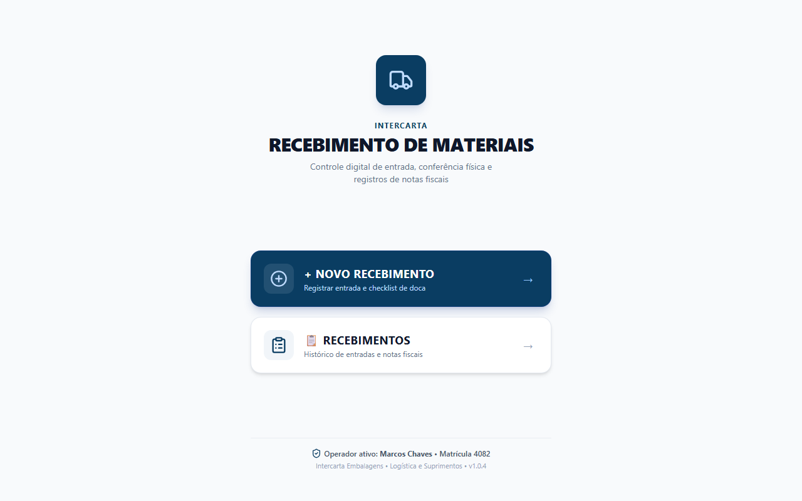

# Recebimento de Materiais

Aplicação web responsiva e PWA para conferência física de matérias-primas e insumos no recebimento de cargas.

Demo online: https://recebimento-materiais.vercel.app



## Sobre o projeto

Desenvolvi esta aplicação a partir de uma necessidade operacional real no setor de logística da empresa onde atuo como Jovem Aprendiz (Intercarta). O objetivo foi digitalizar a conferência de entrada de mercadorias, substituindo pranchetas e formulários impressos por um fluxo no celular. O conferente registra os dados da nota fiscal, fotografa o documento e preenche um checklist de integridade da carga. Os dados são sincronizados no Microsoft Lists e as fotos no SharePoint via Microsoft Graph API.

## Funcionalidades

- Registro de entrada com dados fiscais (número da NF, fornecedor, material, quantidade, lote) e de transporte (transportadora, placa, motorista)
- Captura de foto da DANFE e de eventuais avarias diretamente pela câmera do celular ou upload de arquivo
- Checklist de conferência com 9 critérios de integridade (conservação do veículo, pallets, embalagens, lacres e identificação)
- Classificação automática da carga como Conforme ou Não Conforme
- Histórico de entradas com busca por NF, fornecedor ou material, além de filtro por status
- Detalhamento de cada recebimento com galeria de fotos e apontamentos de desvios

## Tecnologias

- Frontend: React 18, TypeScript, Vite, Tailwind CSS, Lucide React
- Backend: Node.js, Express, TypeScript, @azure/msal-node, @microsoft/microsoft-graph-client
- Serviços: Microsoft Lists (armazenamento dos registros) e SharePoint (armazenamento de fotos)

## Como rodar localmente

Pré-requisitos: Node.js 18+ instalado.

```bash
# Clone o repositório
git clone https://github.com/marcoserculianipw/recebimento-materiais.git
cd recebimento-materiais

# 1. Executar o frontend
cd client
npm install
npm run dev

# 2. Executar o backend (em outro terminal)
cd ../server
npm install
# configure as variáveis no arquivo .env (consulte CONFIGURACAO_MICROSOFT.md)
npm run dev
```

A interface estará acessível em `http://localhost:5173` e a API em `http://localhost:5000`.

## Estrutura do projeto

```text
recebimento-materiais/
├── client/          # Aplicação frontend em React + Vite
│   ├── public/      # Manifesto PWA e ícones
│   └── src/         # Componentes, telas e tipos TypeScript
├── server/          # API em Express e TypeScript
│   └── src/         # Rotas, autenticação MSAL e cliente Graph API
├── docs/            # Capturas de tela e documentação visual
└── CONFIGURACAO_MICROSOFT.md # Guia para configuração no Azure AD
```
